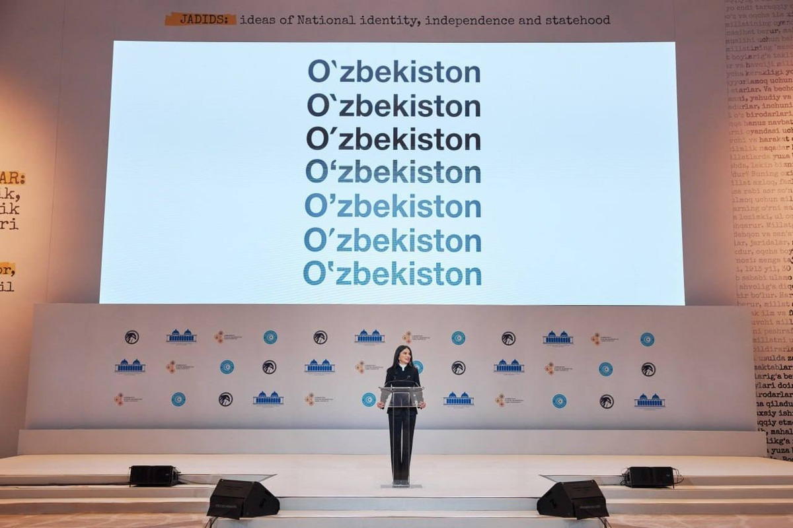

# Oʻzbek lotin alifbosi zamonaviy qurilmalarda

## Tutuq belgisi, oʻ va gʻ harflari

Oʻzbek lotin alifbosi 1995-yildagi islohotlardan soʻng, oʻ va gʻ
harflaridagi teskari vergul hamda tutuq belgisi uchun kompyuter 
tizimlarida qanday belgi ishlatilishi aniq belgilanmagan. Bu holat 
raqamli tizimlarda, xususan, veb-saytlar va ijtimoiy tarmoqlarda 
katta chalkashliklarga sabab boʻlmoqda. Hozirda bir nechta belgilar 
aralash holda qoʻllanilmoqda, masalan:

| Belgi | Unicode | Misol |
| --- | --- | --- |
| ' | U+0027 | O'zbekiston , fe'l |
| \` | U+0060 | O\`zbek tili, fe\`l |
| ‘ | U+2018 | O‘zbekiston |
| ’ | U+2019 | fe’l |
| ʻ | U+02BB | Oʻzbekiston |
| ʼ | U+02BC | Feʼl |

Bu standartning yoʻqligi bir qancha jiddiy muammolarni keltirib 
chiqaradi:

1. **Matn qidirish qiyinlashadi.** Qidiruv tizimlari va dasturlar 
soʻzlardagi turli apostrof belgilarini farqli belgilar deb 
hisoblaydi. Natijada, bir xil soʻz uchun har xil yozuvlar mavjud 
boʻlib, qidiruv natijalari toʻliq chiqmasligi mumkin. Masalan, 
"O'zbekiston" deb qidirgan foydalanuvchi "Oʻzbekiston" soʻzi bor 
maʼlumotni topa olmasligi mumkin.

1. **Apostrof soʻzni ikkiga boʻladi.** Baʼzi dasturlar U+0027 
apostrofini (standart klaviaturadagi  \' belgisi) harf sifatida 
emas, balki soʻzlar orasidagi ajratuvchi belgi deb hisoblaydi. 
Bu matnni qayta ishlashda, masalan, soʻzlarni sanashda yoki 
tarjima qilishda muammolarni keltirib chiqaradi.

2. **Dasturchilar uchun ortiqcha ish.** Dasturchilar matnni qayta 
ishlashda va uni toʻgʻri koʻrsatishda barcha variantlarni hisobga 
olishlari kerak boʻladi. Bu esa dasturlash jarayonini murakkablashtiradi 
va kodni koʻpaytiradi.

## Yechim: Standartlashtirilgan Belgilarni Tanlash

Bu muammolarni bartaraf etish uchun, oʻzbek tili raqamli muhitini 
mahalliylashtirish hamjamiyati, standartlashtirish boʻyicha bir 
qator takliflarni ishlab chiqdi. Bu takliflarga koʻra, rasmiy 
va texnik jihatdan eng toʻgʻri hisoblangan belgilar qabul qilindi. 
Bu belgilar:

- ʻ (U+02BB) — oʻ va gʻ harflaridagi teskari vergul uchun.

- ʼ (U+02BC) — tutuq belgisi uchun.

### Kiritish usullari

Afsuski, hozirda oʻzbek lotin alifbosi uchun standart klaviatura 
tuzilmasi mavjud emas. Shunga qaramay, yuqorida keltirilgan 
standart belgilarni bir qancha usullar orqali kiritish mumkin.

#### Mobil qurilmalar (Android)

**GBoard klaviaturasi** ushbu muammoni eng oson hal qiluvchi 
yechimlardan biridir. GBoard ichida oʻzbek lotin klaviaturasi 
oʻrnatilgan boʻlib, unda oʻ va gʻ harflari toʻgʻri belgilangan.

- GBoard klaviaturasini oʻrnating.

- Til sozlamalari orqali "Oʻzbekcha (Lotin)" klaviaturasini faollashtiring.

<!-- TODO: Include screenshots of GBoard -->

#### Windows va macOS

Windows va macOS operatsion tizimlarida oʻzbek tili uchun standart klaviatura mavjud emas. Shu sababli, bu muammoni hal qilish uchun [Farhodjon Chinberdiev](https://github.com/far5n10v) tomonidan maxsus [dasturiy taʼminot](https://farhodjon.netlify.app/projects/uzbek-typography-keyboard-layouts/) yaratdi. Ushbu dasturni oʻrnatish orqali siz oʻzbek harflari (oʻ, gʻ), shuningdek, turk harflarini (Ö, Ğ, Ş, Ç, İ) terish imkoniyatiga ega boʻlasiz.

- **Tutuq belgisi:** ` (gravis) tugmasini bosing.

- **Oʻ va Gʻ harflari:** `'` (apostrof) tugmasini bosing.

- **Turk harflari (Ö, Ğ, Ş, Ç, İ):** `Alt` (Windows) yoki `Option` (macOS) tugmasini bosib turgan holda tegishli harflarni (`o`, `g`, `s`, `c`, `i`) bosing.

- **Em dash (—):** `Alt + -` (Windows) yoki `Option + -` (macOS) tugmalarini bosing.

- **En dash (–):** `Alt + Shift + -` (Windows) yoki `Option + Shift + -` (macOS) tugmalarini bosing.

- **Uzilmas boʻshliq (non-breaking space):** `Alt + Space` (Windows) yoki `Option + Space` (macOS) tugmalarini bosing.

- **Qoʻshtirnoqlar (“ ”):** `Alt + K` va `Alt + L` (Windows) yoki `Option + K` va `Option + L` (macOS) tugmalarini bosing.

- **Birtirnoqlar (‘ ’):** `Alt + Shift + K` va `Alt + Shift + L` (Windows) yoki `Option + Shift + K` va `Option + Shift + L` tugmalarini bosing.

##### Windows uchun oʻrnatish uchun:

1. Ushbu [veb-saytga](https://farhodjon.netlify.app/projects/uzbek-typography-keyboard-layouts/) oʻting va [Windows uchun](https://farhodjon.netlify.app/projects/uzbek-typography-keyboard-layouts/uzbek-typography-layouts.zip) tugmasini bosing.

2. Arxivni ochganingizdan soʻng ikkita papka paydo boʻladi: *uzbek-cyrillic-typography-layout-2.0* va *uzbek-latin-typography-layout-2.0*.

3. Mos papkaga kirib `setup.exe` faylini ishga tushiring.

4. Kompyuterni oʻchirib yoqish talab qilishi mumkin.

##### macOS uchun oʻrnatish uchun:

1. Ushbu [veb-saytga](https://farhodjon.netlify.app/projects/uzbek-typography-keyboard-layouts/) oʻting va [macOS uchun](https://farhodjon.netlify.app/projects/uzbek-typography-keyboard-layouts/uzbek-typography-layouts.zip) tugmasini bosing.

2. Yuklab olingan *Uzbek Keyboard Layouts.dmg* faylini oching.

3. *Uzbek Keyboard Layouts.bundle* faylini *Drag here to install* nomli yorliqqa yuboring (faylni sudrab yorliq ustiga tashlang).

4. *System Preferences* ichidan *Keyboard → Input Sources* ekraniga oʻting.

5. \+ tugmasini bosib roʻyxatdan yangi terilmalarni qoʻshing (xuddi boshqa terilmalarni qoʻshgandek). Ushbu terilmalar roʻyxatda oʻzbek tili sifatida chiqadi.

#### Linux

Linux operatsion tizimlarida oʻzbek lotin klaviaturasi standart 
oʻrnatilmagan boʻlishi mumkin. Vaqtinchalik yechim sifatida mavjud 
klaviatura tuzilmasini moslashtirish mumkin. Masalan, oddiy US QWERTY 
klaviaturasini oʻzgartirish orqali ʻ va ʼ belgilarini kiritish imkoniyati 
yaratiladi. Bu usul texnik bilimni talab etadi, lekin tizimga toʻliq 
integratsiya boʻlgan yechim hisoblanadi.

<!-- TODO: Include screenshot of modified keyboard layout on Linux -->
<!-- TODO: Include skript for uzbek keyboard layout on Linux -->

<!-- TODO: Explore other popular options: Samsung keyboard, SwiftKey, etc. -->

<!-- TODO: Input options for iOS -->

### Havolalar

- [https://lex.uz/docs/-112286](https://lex.uz/docs/-112286)
- [https://uz.wikipedia.org/wiki/%CA%BB_(belgi)](https://uz.wikipedia.org/wiki/%CA%BB_(belgi))
- [https://uz.wikipedia.org/wiki/%CA%BB_(belgi)](https://uz.wikipedia.org/wiki/%CA%BC_(belgi))
- [Oʻzbekcha tipografik klaviatura terilmalari](https://farhodjon.netlify.app/projects/uzbek-typography-keyboard-layouts/)
